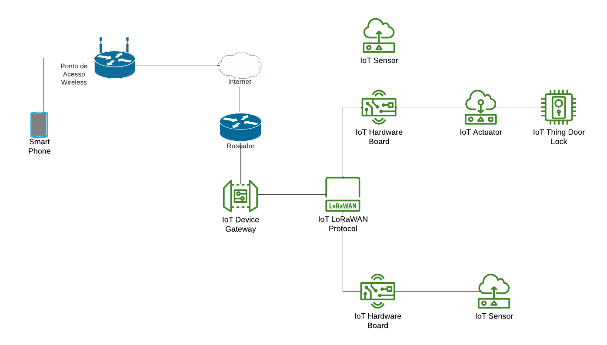

# Projeto de IoT

### Nome do projeto: Controle de garagem

## Objetivos
Desenvolver um sistema para uma casa inteligente automatizada e conectada visando proporcionar conforto e segurança aos moradores desta residência.
### Funcionalidades
Automatizar a abertura e o fechamento de um portão de garagem que, através de sensores, emitirá para uma plataforma móvel o estado em que se encontra o portão para que seja tomada a decisão pelo usuário de abrir, fechar ou deixar o portão no estado em que se encontra. Ainda sendo possível detectar quem o acionou.

### Controla: Fluxo de entrada e saída da garagem
### Monitoria: Estado do portão (aberto/fechado), com segurança.
## Arquitetura: Centralizada
Seria interligado um servidor central via wi-fi, onde se comunicaria com a aplicação  

### Protocolo: MQTT
### Microcontrolador: ESP32
## Aplicação: ESP RainMaker

