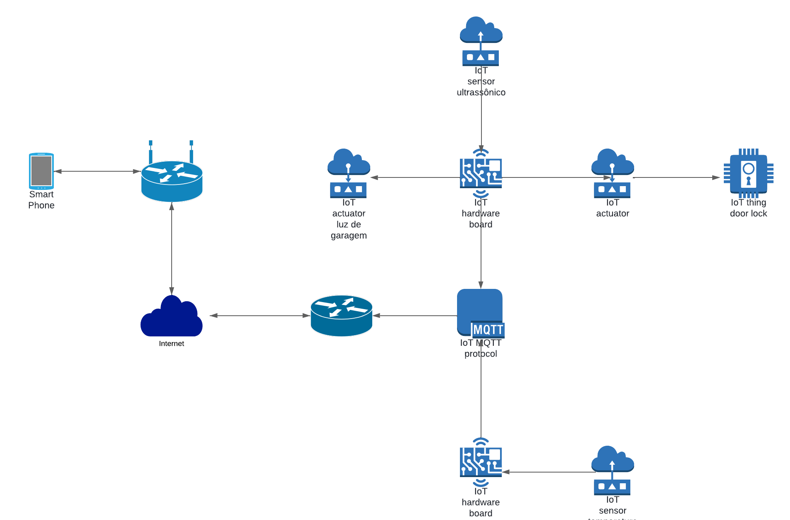

<h1 align="center" ><b>Controle de Garagem</b></h1>

## Objetivos
Desenvolver um sistema para uma casa inteligente automatizada e conectada visando proporcionar conforto e segurança aos moradores desta residência.
### Funcionalidades
Automatizar a abertura e o fechamento de um portão de garagem que, através de sensores, emitirá para uma plataforma móvel o estado em que se encontra o portão para que seja tomada a decisão pelo usuário de abrir, fechar ou deixar o portão no estado em que se encontra. Ainda sendo possível detectar quem o acionou.
- Automatizar o fechamento do portão
- Detectar presença de pessoas e objetos
- Controle de abertura
- Enviar informações do estado do portão para a plataforma

### Controla: Fluxo de entrada e saída da garagem.
### Monitoria: Estado do portão (aberto/fechado), com segurança.
## Arquitetura: Centralizada
Seria interligado um servidor central via wi-fi, onde se comunicaria com a aplicação, facilitando o monitoramento e o controle do dispostivo IoT.  

### Lista de Dispositivos IoT
- Sensor de abertura de porta
- Atuador de contato seco
- Sensor de movimento
- ESP32

### Protocolo: MQTT (Message Queuing Telemetry Transport)
Facilitar a troca de mensagens entre dispositivos IoT de forma confiável e assíncrona.
### Microcontrolador: ESP32
## Aplicação: ESP RainMaker

### Equipe: 
- Ismael Marinho - firespin147@gmail.com
- José Roberto - ferreira.roberto@academico.ifpb.edu.br
- Lavoisier Chaves - lavoisier.ramos@academico.ifpb.edu.br

## Implementação do nó de Temperatura e Humidade

O código utilizado foi o seguinte: [Código](https://github.com/robertofilhosf/iot/blob/main/codigos/temperaturaHumidade.c)  

O Código consiste em criar uma conexão wifi, e se comunicar via MQTT para o broker no caso o "broker.emqx.io", e publicar
nos tópicos "IFPB/Iot/Projeto.Garagem/Temperatura" e "IFPB/Iot/Projeto.Garagem/Umidade", para que possa ser acompanhado
de perto pelo App Mobile.

## Implementação do nó do Portão

O código utilizado foi o seguinte: [Código](https://github.com/robertofilhosf/iot/blob/main/codigos/portaoLuz.c)  

O Código consiste em criar uma conexão wifi, e se comunicar via MQTT para o broker no caso o "broker.emqx.io", e receber
através dos tópicos "IFPB/Iot/Projeto.Garagem/Atuador.Portao" e  "IFPB/Iot/Projeto.Garagem/Luz", e por eles
possam através do atuador, no caso o relé desligar a luz e fechar ou abrir o portão. Também por usar o sensor de proximidade
ultrassonico é possível fazer o monitoramento de abertura do portão. No qual o código publica no tópico 
"IFPB/Iot/Projeto.Garagem/Sensor.Portao".

## App Mobile

O App mobile foi utilizado para fazer a gerência e observação dos dados emitidos pelos nós.
O App utilizado foi o [IoT MQTT Panel](https://play.google.com/store/apps/details?id=snr.lab.iotmqttpanel.prod&hl=en&pli=1), no 
qual criamos um dashboard da seguinte maneira:

### Configurando o botão de luz

### Configurando o gráfico de temperatura

### Configurando o gráfico de humidade

### Configurando o sensor do portão(Aberto/Fechado)

### Configurando o atuador do portão(Abrir/Fechar)

